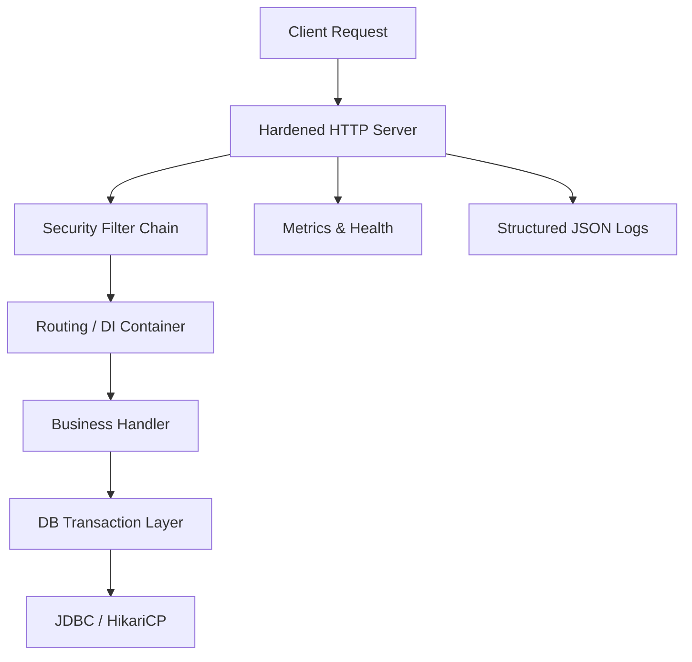

# IgniteBoot Architecture

## Core Architecture

## Modular, Pluggable Design

- Core engine provides the minimum required runtime: server, routing, DI, security, and observability.
- Optional features live in separate modules/packages and are registered explicitly.
- Keep modules pluggable by defining extension interfaces and lightweight registration APIs:
  - `Feature` / `Extension`
  - `ServerPlugin` for request filters and handlers
  - `DataPlugin` for transaction and repository hooks
  - `SecurityPlugin` for auth, RBAC, ABAC, and header policies
- Avoid classpath auto-configuration unless explicitly enabled.
- Use Java `ServiceLoader` or a manual `FeatureRegistry` to load optional behavior.

## Spring-Like Capability Mapping

- IoC/DI: annotations like `@Component`, `@Service`, `@Controller`, explicit configuration classes.
- Lifecycle callbacks: support `@PostConstruct` / `@PreDestroy`.
- Scopes: singleton and request scopes first; session/application scopes later if required.
- Configuration: lightweight property source API with environment overrides and optional YAML.
- Transactions: programmatic or annotation-driven boundaries without JPA.
