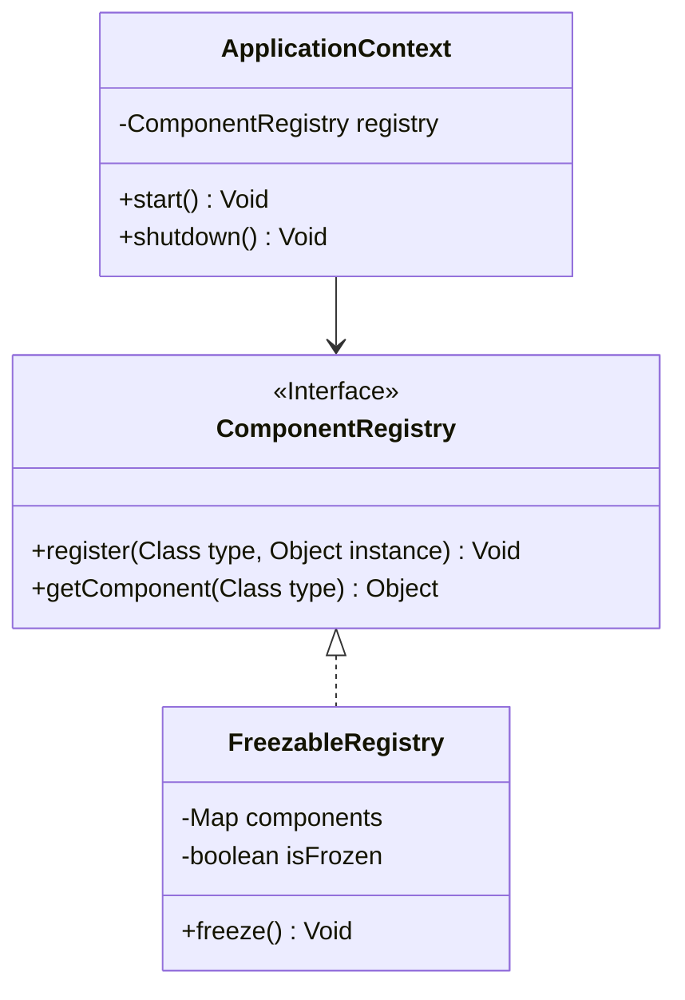

# Architecture (High Level)

One-paragraph: IgniteBoot provides an AOT generation CLI, curated toolkits, and a tiny runtime that wires generated routing and an explicit interceptor chain. Cross-cutting features (masking, lineage, WAL, mTLS) are provided as toolkits, not implicit runtime behavior.

Cross-cutting features: masking, lineage/audit ledger, micro-batch WAL, interceptor pipeline, signed plugins, air‑gapped deployment guidance.

