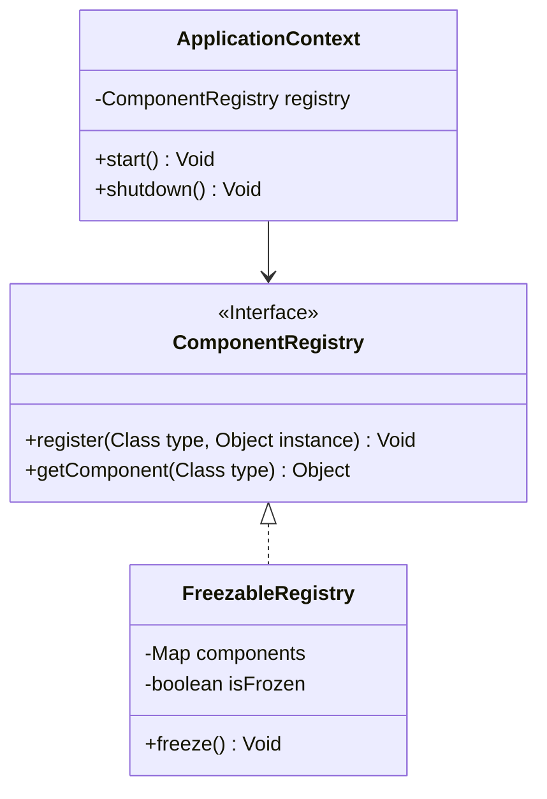

# Architecture (High Level)

IgniteBoot is an AOT-first platform: a schema transformer generates explicit code, and a tiny runtime wires generated routing and a clear execution pipeline.

## Core Principles

- Design-first input: the API contract and compliance policy are the source of truth.
- Ahead-of-time translation: the transformer resolves routes, DTOs, and validations before runtime.
- Explicit runtime execution: requests follow a predictable, linear flow with no runtime framework magic.
- Compliance by construction: security, masking, lineage, and audit concerns are modeled as first-class design constraints.

## Architectural Boundaries

- Design boundary: declarative API specifications and policy gates define what is allowed.
- Transformer boundary: the build-time engine emits explicit Java source and routing artifacts.
- Runtime boundary: the generated application links only to a lightweight execution core.

## Security and Compliance Model

- Validate headers, query parameters, path parameters, and bodies separately.
- Enforce role-aware authorization and secure transport defaults.
- Use structured error handling so validation and auth failures return safe HTTP responses.
- Record lineage and ledger events for auditability and replay safety.

## Runtime Shape

