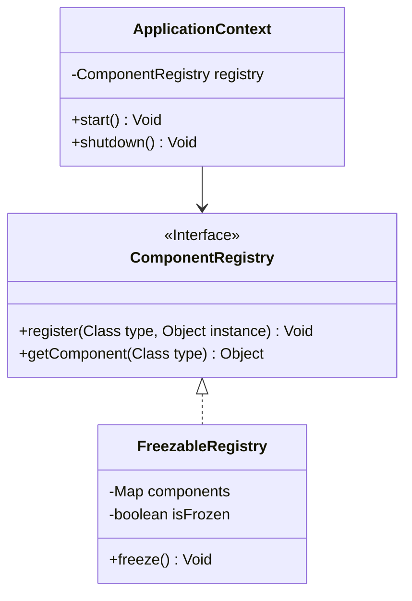

# Architecture (High Level)

IgniteBoot is an AOT-first platform: a CLI generates explicit code, small toolkits provide reusable pieces, and a tiny runtime wires generated routing and a clear interceptor chain.

- Core concepts:
  - AOT CLI → curated toolkits → tiny explicit runtime
  - Component registry + optional freeze for runtime immutability
  - Cross-cutting: masking, lineage/audit ledger, micro-batch WAL, interceptor pipeline, signed plugins
- Goals:
  - Minimal runtime surface, explicit wiring, verifiable compliance
  - Air‑gapped deployment guidance for high-security environments

