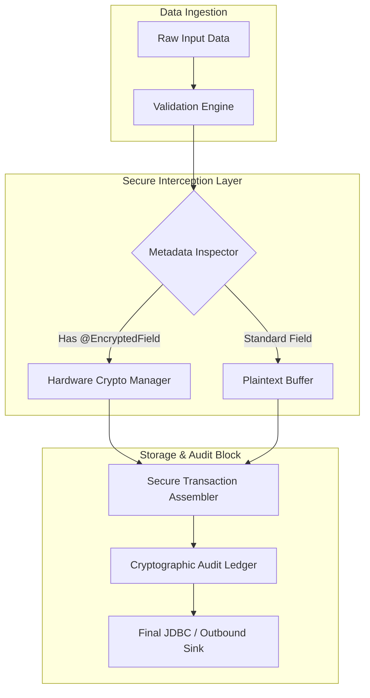

# Ledger (High Level)

Micro-batch policy: flush a batch when either 50 transactions accumulate or 5ms elapse. Before committing to the database, append the batch to a WAL (fsync) for recovery and idempotent replay.

