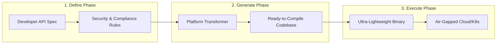
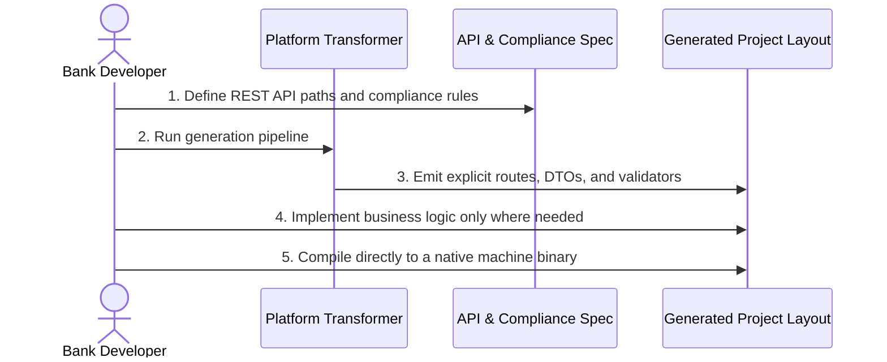

# Overview

IgniteBoot is a contract-first developer platform for building lightweight, secure REST APIs without Spring Boot–style runtime magic.

The platform is organized around three clear boundaries:
- design boundary: declarative API and policy definitions
- transformer boundary: ahead-of-time generation of explicit Java source
- runtime boundary: a lean execution process with no framework runtime overhead

