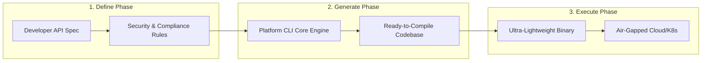
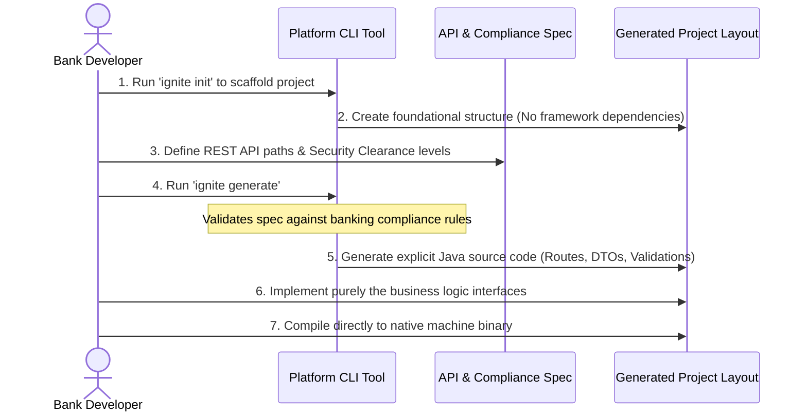

# Overview

IgniteBoot is a contract-first developer platform for building lightweight, secure REST APIs without Spring Boot–style runtime magic.

Topology: CLI (AOT codegen) → Toolkits (small libraries) → Runtime (explicit bootstrap and interceptor chain).

